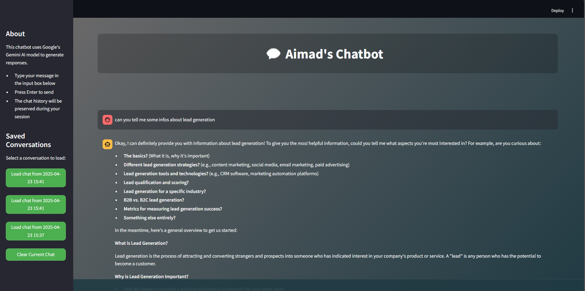

# 🤖 AI Chatbot with Gemini API


A sophisticated chatbot application powered by Google's Gemini AI, featuring a modern UI and conversation management system.

## ✨ Features

- 🎯 Real-time AI responses using Google's Gemini API
- 💾 Conversation history storage with MongoDB
- 🎨 Sleek, gradient-based UI design
- 📱 Responsive layout for all devices
- 💬 Chat history management
- 🔄 Load previous conversations
- 🗑️ Clear chat functionality

## 🚀 Quick Start

### Prerequisites

- Python 3.8 or higher
- MongoDB installed and running
- Gemini API key

### Installation

1. Clone the repository:
```bash
git clone https://github.com/yourusername/chatbot.git
cd chatbot
```

2. Install required packages:
```bash
pip install streamlit requests pymongo
```

3. Set up your API key:
- Create a file named `API` in the project root
- Paste your Gemini API key inside

### 🎮 Running the Application

```bash
streamlit run chatbot.py
```

## 🛠️ Technology Stack

- **Frontend**: Streamlit
- **AI Model**: Google Gemini API
- **Database**: MongoDB
- **Language**: Python

## 🎯 Key Components

- **Real-time Chat Interface**: Clean and intuitive chat UI
- **Conversation Management**: Save and load chat histories
- **Custom Styling**: Modern gradient background with responsive design
- **Error Handling**: Robust error management for API and database operations

## 📸 Screenshots



## 🔧 Configuration

The application can be configured through the following:

- MongoDB connection string in `chatbot.py`
- UI customization in the `styling` variable
- API settings in the `get_gemini_response` function

## 🤝 Contributing

Contributions are welcome! Please feel free to submit a Pull Request.

## 📝 License

This project is licensed under the MIT License - see the LICENSE file for details.

## 🙏 Acknowledgments

- Google Gemini API for providing the AI capabilities
- Streamlit for the amazing web framework
- MongoDB for reliable data storage

